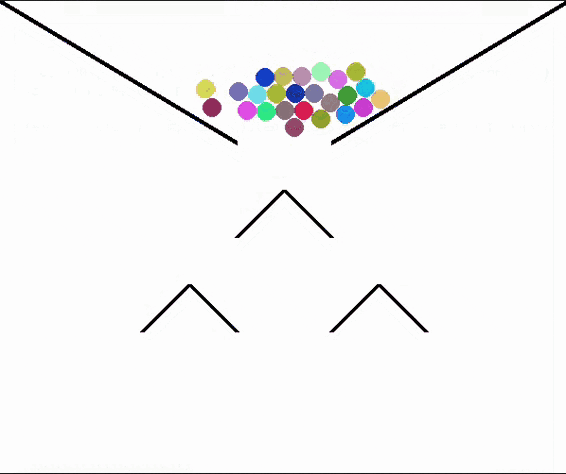

<p align="center">
  
</p>

<div style="text-align: justify">
Physics_Engine is a python library that allows users to create simple yet realistic simulations of collisions between massive circles and line segments within some boundary conditions.
</div>

#
This library provides two main object classes: 'Particle' and 'Line'. Given a set of particles and line segments the main 'Engine' function creates a real-time simulation and graphic animation of the interaction between particles and lines.

Particles will bounce off other particles, lines or boundaries according to newtonian mechanics, preserving energy thanks to the implementation of a Verlet algorithm used to move the particles.
<p align="center">
<table><tr>
<td> 
  <p align="center" style="padding: 30px">
    
    <br>
    <em style="color: grey">Pachinko</em>
  </p> 
</td>
<td> 
  <p align="center">
    
    <br>
    <em style="color: grey">Closed Circle Boundary</em>
  </p> 
</td>
</tr></table>
</p>
In order to create a particle 'p' one must procede to inicializate as follows
```
p = Particle(Position, Velocity, Mass, Radius, Color, Dynamic)
```
In order to create a line segment 'l' one must procede to inicializate as follows
```
l = Line(Point_A, Point_B)
```

The environment in which the objects exist must be determined by the user, this includes:

- Window_Size: Size of the window screen in pixels
- Background: Function comprised of pygame code to draw anything on the screen background
- Boundary: Function that changes the position and velocity of particles defining some boundary
- Force: Function that describes the force felt by a particle

The library includes some predefined functions that could be used to describe the environment
- Boundaries:
  - Closed_Box_Boundary
  - Periodic_Boundary
  - Closed_Circle_Boundary
- Circle_Boundary_Background
- Const_Gravity

##
This python library allows multiple aplications, including physics simulations with real educational value, a great example might be the simulation presented bellow, with two gases separated by a chamber, blue particles have greater average velocity than red particles. This could be used to demonstrate principles in thermodinamics and statistical physics
<p align="center">
  <figure align="center">
  
</figure>
</p>


<!-- START OF LICENSE -->
<p xmlns:dct="http://purl.org/dc/terms/" xmlns:cc="http://creativecommons.org/ns#" class="license-text">
  <a rel="license" href="http://creativecommons.org/licenses/by-nc-nd/4.0/">
    
  </a><br />
  This work is licensed under a
  <a rel="license" href="http://creativecommons.org/licenses/by-nc-nd/4.0/">Creative Commons Attribution-NonCommercial-NoDerivatives 4.0 International License</a>.
</p>
<!-- END OF LICENSE -->
